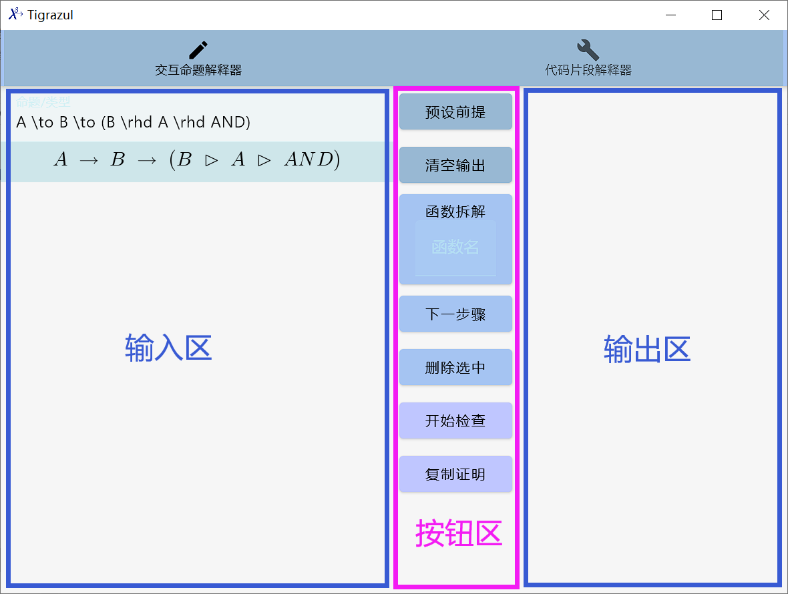
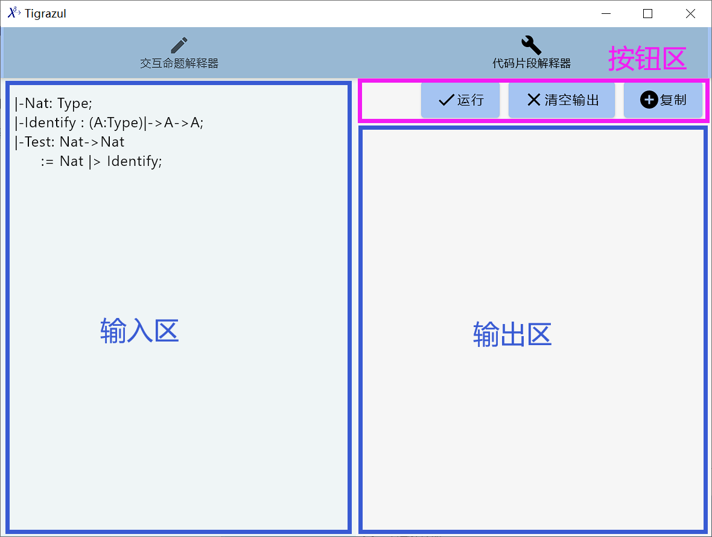
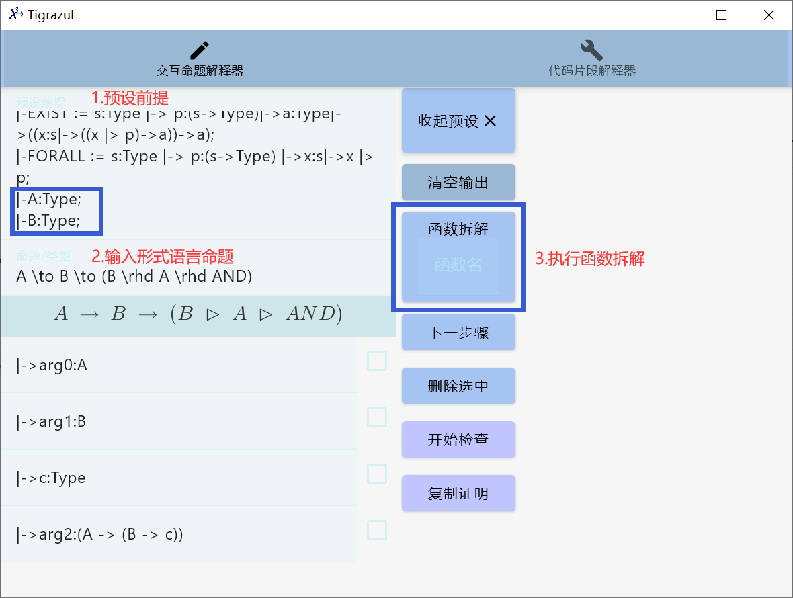
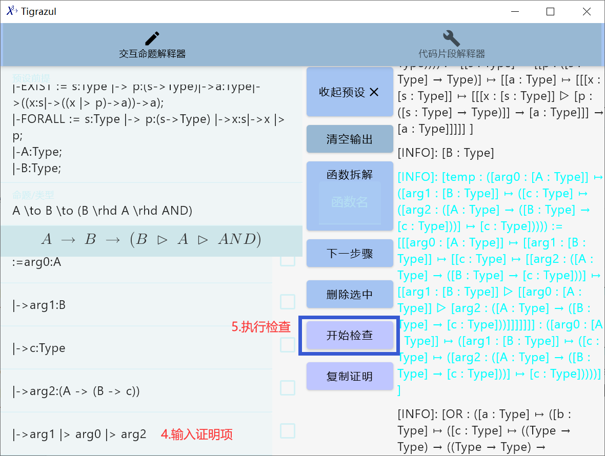
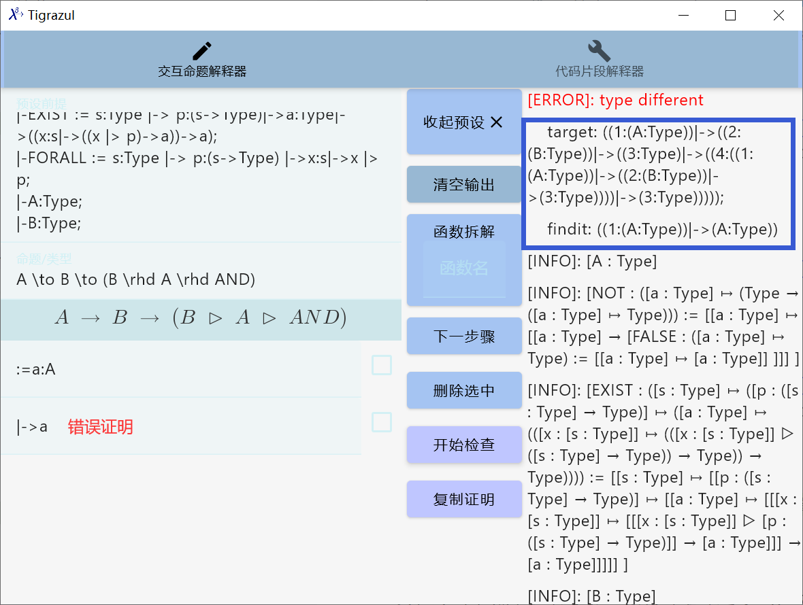
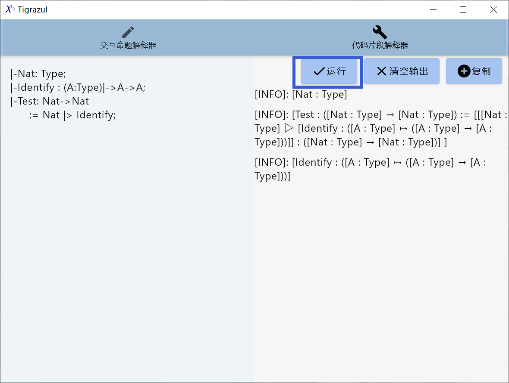

# Tigrazul

## 实验数据集

[这里](./docs/test.pdf)

## 主要模块

证明解释器UI工具主要分为两个基本模块，点击上方的名称即可切换模块。

+ 交互命题解释器：主要是通过按钮的操作与分步骤的输入，来进行证明。
+ 代码片段解释器：直接输入代码片段，可以对代码片段进行类型检查。

### 交互式命题解释器

在交互命题解释器中，主要分为三个区域

+ 输入区：在这里输入命题与相应的证明
+ 按钮区：在这里可以修改一些设置、执行一些操作
  + 预设前提：点击后展开预设前提区域。在区域中预设证明的前提，一般预设一些命题逻辑、一阶逻辑的Tigrazul语言书写形式。
  + 清空输出：清空输出区。
  + 函数拆解（可以输入要拆解的函数名）：预设函数的参数作为前提，例如`f:(Nat->Nat)`，将预设一个参数`arg0:Nat`作为前提。当没有输入函数名时，默认拆解输入的命题，当输入函数名时，拆解该函数。
  + 下一步骤：当选中某一行步骤时，下一步骤将添加新的一行到选中行后面；当没有选中时，将添加新的一行到所有证明行的末尾。
  + 删除选中：当选中一些行步骤时，点击删除选中则将这些行移除。
  + 开始检查：对已经书写的命题以及对应的证明进行检查。
  + 复制证明：复制完整的Tigrazul形式语言证明。
+ 输出区：在这里可以看到每次检查输出的结果。



### 代码片段解释器

在代码片段解释器中，主要分为三个区域：

+ 输入区：在这里输入Tigrazul语言代码
+ 按钮区：
  + 运行：运行Tigrazul语言代码，进行类型检查
  + 清空输出：清空输出区
  + 复制：复制输出区内容
+ 输出区：在这里是运行结果以及类型检查结果



## 命题证明实例

进入交互命题解释器。

首先点击“预设前提”，设置实验的证明前提内容。

```tigrazul
|-FALSE := a:Type |-> a;
|-NOT := a:Type |-> (a->FALSE);
|-AND := a:Type |-> b:Type |-> c:Type |-> (a->b->c)->c;
|-OR := a:Type |-> b:Type |-> c:Type |-> (a->c)->(b->c)->c;
|-EXIST := s:Type |-> p:(s->Type)|->a:Type|->((x:s|->((x |> p)->a))->a);
|-FORALL := s:Type |-> p:(s->Type) |->x:s|->x |> p;
|-A:Type;
|-B:Type;
```

其次将测试用例中的自然语言命题翻译为Tigrazul形式语言命题。例如命题“如果A成立，则如果B成立的情况下，A成立且B成立”（数学语言对应命题为“前提：$A,B$ 结论：$A \land B$”），根据PAT解释中蕴涵逻辑与函数类型的对应，将其翻译成“A -> B -> B |> A |> AND”。

将形式语言命题输入“命题/类型”输入框中，并在预设环境中补充“|-A:Type;”与“|-B:Type;”作为证明的前提。点击“函数拆解”。实验过程如图所示。



点击下一步骤，补充对应到类型C的项“|-> arg1 |> arg0 |> arg2”，点击“开始检查”，得出通过交互命题解释器的形式验证结果，如果类型检查通过，则用蓝色字体标出。实验过程如图所示。



如果形式验证失败，则会输出红色字体标出的“ERROR”与进行类型检查的信息。形式验证失败如图所示。



复制出证明解释器中的完整证明，补充注释，更改参数命名，最终得到完整的Tigrazul形式语言证明。

## 代码运行实例

进入代码片段解释器。

设置输入区的代码。点击【运行】。查看输出情况。


