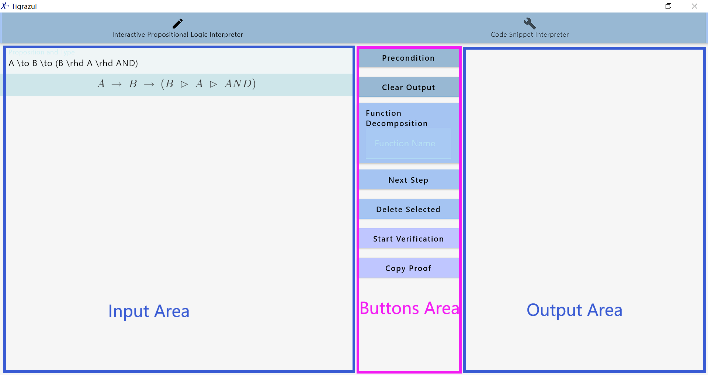
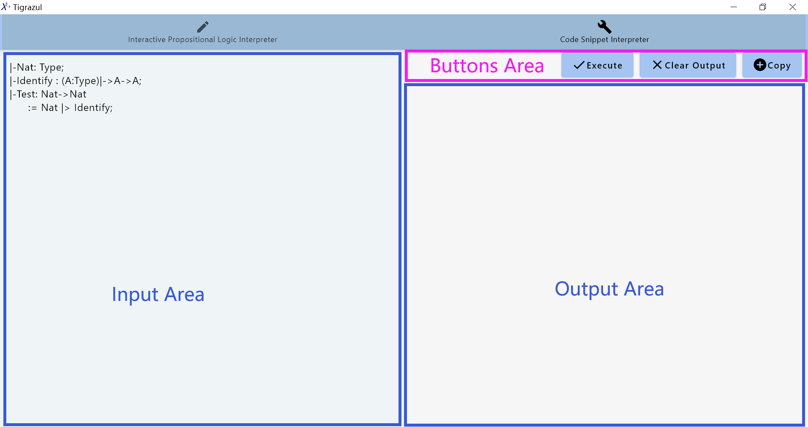
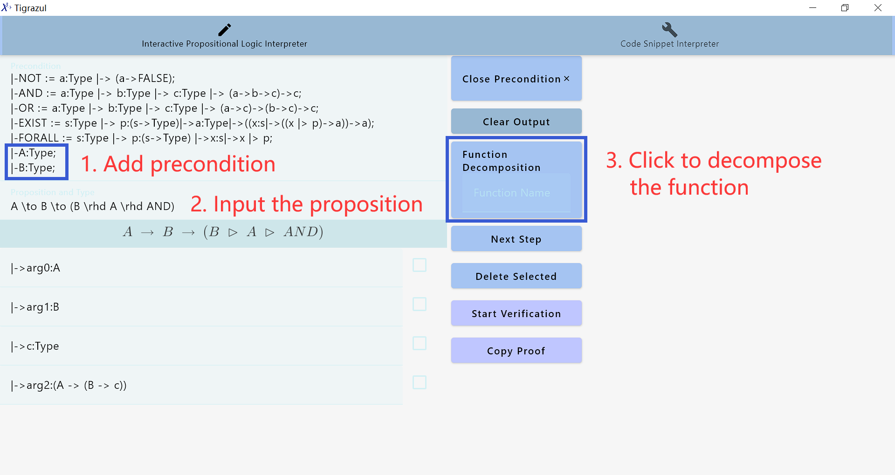
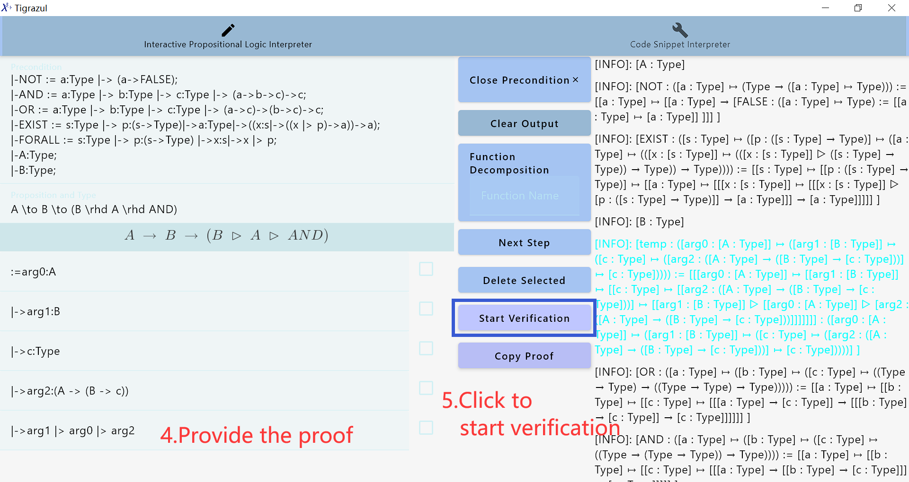
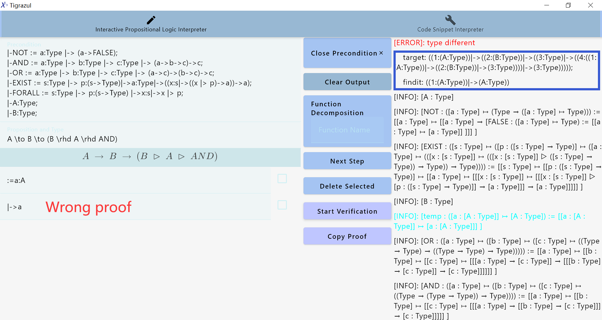
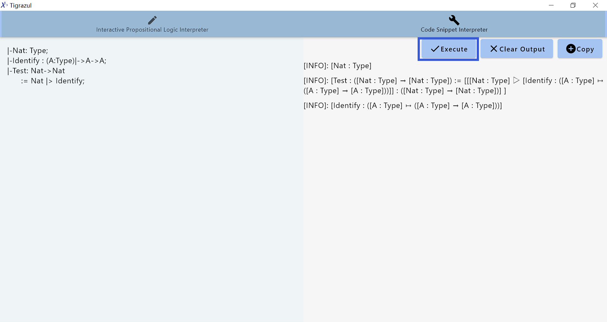

# Tigrazul

Tigrazul is an Interpreter for proposition proof based on the theory of type lambda calculus. It can help people to deal with the proposition written in first-order logic.

## Main module

The proof assistant UI tool includes two basic modules, and you can switch between modules by clicking on the name at the top

+ **Interactive Propositional Logic Interpreter**: It is mainly achieved through button operations and step-by-step inputs to carry out the proof.
+ **Code snippet interpreter**: Allows direct input of code snippets and performs type checking on the code snippets.

### Interactive Propositional Logic Interpreter

It is mainly divided into three areas.

+ Input Area: enter the proposition and its corresponding proof.
+ Buttons Area: modify some settings and perform some operations.
  + Precondition: Click to expand this button. In this area, you can set the precondition for the proof, typically in the Tigrazul language grammar for propositional logic or first-order logic.
  + Clear Output: Clear the output area.
  + Function Decomposition (The function name to be decomposed can be entered in this area.): Set the function's parameters as assumptions. For example, for a function `f:(Nat->Nat)`, you can set an assumption like `arg0:Nat`. When no function name is provided, the input propositions are automatically decomposed. When a function name is provided, that function is decomposed.
  + Next Step: When a specific row is selected, the next step will add a new row immediately after the selected row. When no row is selected, the next step will add a new row at the end of all proof rows.
  + Delete Selected: When some rows are selected, clicking 'Delete Selected' will remove those rows.
  + Start Verification: Verify the written propositions and their corresponding proofs.
  + Copy Proof: Copy the complete proof in Tigrazul formal language.
+ Output Area: results of each verification can be seen.



### Code snippet interpreter

In the code snippet interpreter, there are mainly three areas:

+ Input Area: Input Tigrazul language code here.
+ Buttons Area：
  + Execute: Executes Tigrazul language code and performs type checking.
  + Clear Output: Clears the output area.
  + Copy: Copies the content of the output area.
+ Output Area: Displays the execution results and type checking results.



## Example of propositional proof

Enter the interactive propositional proof interpreter.

First, click on "Precondition" to define the premises for the proof experiment.

```tigrazul
|-FALSE := a:Type |-> a;
|-NOT := a:Type |-> (a->FALSE);
|-AND := a:Type |-> b:Type |-> c:Type |-> (a->b->c)->c;
|-OR := a:Type |-> b:Type |-> c:Type |-> (a->c)->(b->c)->c;
|-EXIST := s:Type |-> p:(s->Type)|->a:Type|->((x:s|->((x |> p)->a))->a);
|-FORALL := s:Type |-> p:(s->Type) |->x:s|->x |> p;
|-A:Type;
|-B:Type;
```

Next, translate the natural language proposition from the test case into Tigrazul formal language proposition. For example, the proposition "if A happens, then if B happens, A and B happen". (corresponding to the mathematical proposition "Premise: $A,B$  ，Conclusion: $A \land B$") can be translated into "A -> B -> B |> A |> AND" based on the correspondence between implication logic and function types in PAT interpretation.

Proceeding to Enter the formal language proposition in the "Proposition and Type" input box and add "|-A:Type;" and "|-B:Type;" as premises for the proof in the preset environment. Click on "Function Decomposition".  

The experimental process performed like the picture below.



Move to the button of next step and fill in the corresponding term for type C as "|-> arg1 |> arg0 |> arg2". Click on "Start Verification" to obtain the formal verification result through the interactive proposition interpreter.

If the type checking passes, it will be highlighted in *blue*. 

The experimental process is shown in the figure.



If the formal verification fails, the "ERROR" message along with the type checking information will be displayed in *red* font.

The formal verification failure is depicted in the figure.



As a final step，Copy the complete proof from the proof interpreter, add comments, modify parameter names, and obtain the complete proof of the Tigrazul formal language.

## Example of code execution

Enter the code snippet interpreter. 

Set the code in the input area. Click on "Execute". then, Check the output.


